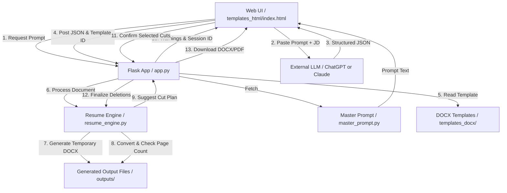

# ResumeForge Architecture Documentation

This document describes the design patterns, module relationships, and data/request lifecycles in the ResumeForge application.

---

## Component Architecture

---

## Detailed Data and Request Lifecycle

### 1. Initial Processing Phase (`/api/process`)
1. **JSON Payload Receival:** The Flask endpoint receives the selected `template_id`, `role_name`, and the raw `json_data` from the client.
2. **Copying Template:** The engine makes a copy of the template `.docx` and saves it in the `outputs/` folder with a unique session-based name: `Rayen_[Role_Name]_[session_id].docx`.
3. **XML Parsing & Modification (`apply_json_to_docx`):**
   - The DOCX file is unzipped in memory.
   - `word/document.xml` is parsed into an element tree using `lxml.etree`.
   - The engine queries specific paragraphs using a structural map (`map_document_structure`):
     - **Title Line:** Replaced preserving run formatting.
     - **Profile Summary:** Replaced preserving run formatting.
     - **Core Competencies:** Modified in-place splitting bold category labels and normal skill lists.
     - **Certifications:** Slot 0 is modified in the table (row 4) and its description bullet. Slots 1–3 are mapped outside the table; any unused slots are instantly queued for deletion.
     - **Projects:** Core project descriptions and lists of bullets are replaced.
     - **Extracurriculars:** Dynamic reframing applied (hard cap at 3 items).
   - Reassembled XML is zipped back into the DOCX file.
4. **Length and Fit Verification (`check_page_count`):**
   - The newly modified DOCX is converted to PDF (utilizing `docx2pdf`, Word COM, or headless LibreOffice).
   - The number of pages is counted by reading the binary PDF data and matching `/Type /Page` occurrences.
   - If the page count is exactly 1, the session is registered as clean and is ready for immediate download.
   - If the page count is greater than 1, `get_cut_plan` is triggered.

### 2. Cut Plan Evaluation Phase (`get_cut_plan`)
If the document overflows, the engine generates a list of suggested removals sorted by relevance priority:
- **Pass 1 (High Priority Cuts):** Projects marked as `include: false` in the LLM output. The engine first suggests trimming their last bullet, followed by removing the entire project.
- **Pass 2 (Medium Priority Cuts):** Projects marked as `include: true`. The engine suggests trimming the last bullet point to save vertical space.
- **Pass 3 (Low Priority Cuts):** Shortening the profile summary.

### 3. Confirmation & Finalization Phase (`/api/confirm`)
1. The user checks the warnings they approve in the web UI.
2. The UI sends a list of approved warning indices back to `/api/confirm`.
3. **Applying Deletions (`apply_confirmed_deletions`):**
   - The engine opens the temporary DOCX.
   - It parses `word/document.xml` and removes the selected paragraph elements from the body using the recorded index positions in reverse order (to maintain index stability).
   - Saves the updated DOCX.
4. **Preview Integration (`/api/preview/<session_id>`):**
   - The frontend retrieves the final JSON representation of the resume details to render a live browser preview.

### 4. Conversion & Delivery Phase (`/api/download/<session_id>/<format>`)
- If the user downloads `.docx`, the file is sent directly.
- If the user downloads `.pdf`, a conversion pipeline runs:
  - **Method 1:** Python `docx2pdf` library (automates MS Word if installed locally).
  - **Method 2:** Direct Windows PowerShell scripting interacting with the Microsoft Word COM object model (`Word.Application`).
  - If conversion succeeds, the `.pdf` is served. If both fail, an error is returned.
